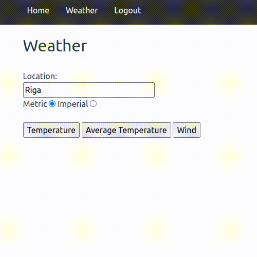

# Weather API

### Register and Login


### Weather



## Technologies used

- PHP 7.4
- mySQL 8.0
- Composer 2.4
- Symfony 5.4 and Symfony CLI

## Instructions

1. Clone this repository and navigate to its directory by using the commands:
    ```
    git clone https://github.com/tomskoralis/symfony-weather
    cd symfony-weather/
    ```
2. Install the required packages using the command:
    ```
    composer install
    ```
3. Register at https://home.openweathermap.org/users/sign_up and get the API key
4. Save the API key in the application environment using the command:
    ```
    symfony console secrets:set API_KEY
    ```
5. Generate SSL keys using the command:
    ```
    symfony console lexik:jwt:generate-keypair
    ```
6. Make a copy of the `.env.example` and rename the copy to `.env`
7. Enter mySQL username and password in the `.env` file by replacing the USER and PASSWORD in the `DATABASE_URL`
8. Create a new database and run the migrations using the commands:
    ```
    symfony console doctrine:database:create
    symfony console doctrine:migrations:migrate
    ```
9. Run the application in the development environment by using the command:
    ```
    symfony serve
    ```
10. Open the application in a browser using the URL http://127.0.0.1:8000/